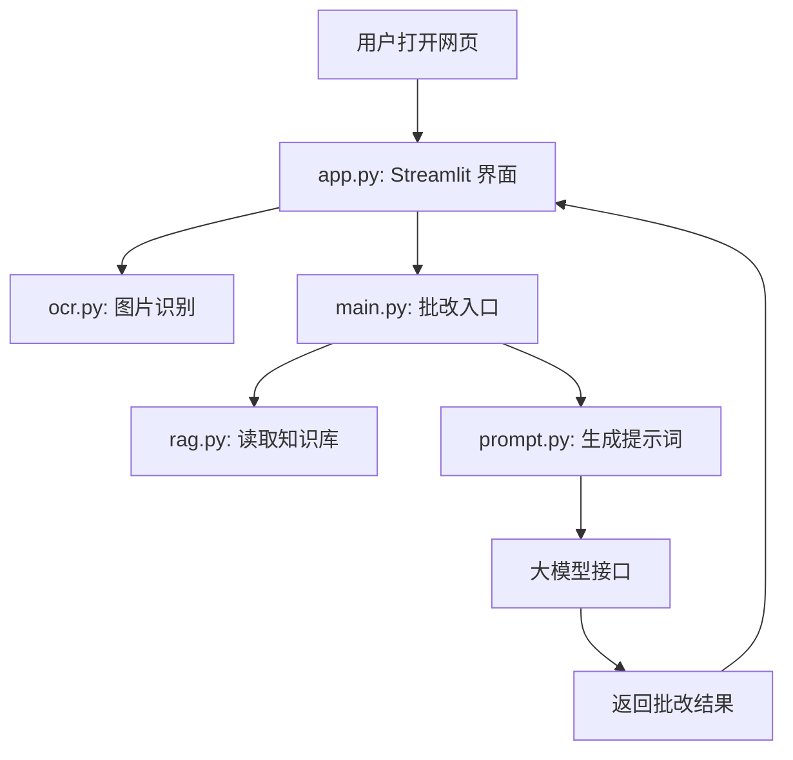

# 整体架构

项目可以理解为四层：

## 数据流

1. `app.py` 收集作文题目和作文内容。
2. 如果用户上传图片，`app.py` 会调用 `ocr.py` 识别文字。
3. 点击“开始批改”后，`app.py` 调用 `main.py` 里的 `grade_essay(topic, essay)`。
4. `grade_essay` 调用 `rag.py` 读取知识库资料。
5. `grade_essay` 调用 `prompt.py` 把题目、作文、知识库组合成完整提示词。
6. `main.py` 把提示词发给大模型。
7. 批改结果返回到网页显示。

## 为什么这样拆分

这样拆分的好处是每个文件只负责一类事情：

| 模块 | 职责 |
| --- | --- |
| 页面 | `app.py` 只管用户界面 |
| 图片识别 | `ocr.py` 只管 OCR |
| 批改流程 | `main.py` 只管模型调用 |
| 知识库 | `rag.py` 只管读取参考资料 |
| 提示词 | `prompt.py` 只管组织批改要求 |
