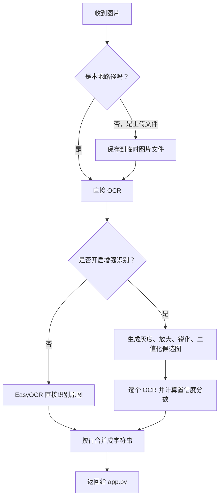

# ocr.py：图片文字识别

`ocr.py` 负责把图片里的英文文字识别出来。

项目使用的是 `EasyOCR`：

```python
easyocr.Reader(["en"], gpu=False)
```

这里的意思是：

| 配置 | 含义 |
| --- | --- |
| `["en"]` | 主要识别英文 |
| `gpu=False` | 使用 CPU，兼容性更好 |

## 主要流程



## 手写体为什么容易识别差

EasyOCR 的流程可以简单理解为两步：

1. 找出图片里哪里有文字。
2. 把每个文字区域识别成字符。

它对印刷体、截图、清晰拍照文本更稳定。手写体会更难，因为每个人字母形状不同，连笔、倾斜、行距不齐、拍照阴影、纸张弯曲都会影响文字区域检测和字符识别。

当前项目的“增强手写识别”属于本地预处理改进：先把图片放大、转灰度、增强对比度、锐化、二值化，再选择识别置信度更高的结果。它能改善清晰手写图，但如果手写非常潦草，最终仍需要更专业的手写 OCR 或视觉大模型。

## 为什么上传文件要先保存成临时文件

Streamlit 上传的图片不是普通文件路径，而是一个上传对象。

EasyOCR 更适合读取本地图片路径，所以 `ocr.py` 会临时保存图片，再把临时路径交给 EasyOCR。

识别完成后，临时文件会被删除。

```{literalinclude} ../ocr.py
:language: python
```
